# ThreatIntel Platform

**A self-hosted threat-intelligence database that aggregates public feeds, links
vulnerabilities to attacker behaviour, and adds a detection-coverage layer — so a team
sees not just *what* threats exist, but *whether they could detect them*.**

Built on **React · Node.js / Express · PostgreSQL**, pulling from four public sources:
**MITRE ATT&CK** (techniques), **NVD / NIST** (CVEs), **Abuse.ch** (IOCs), and
**AlienVault OTX** (threat actors).

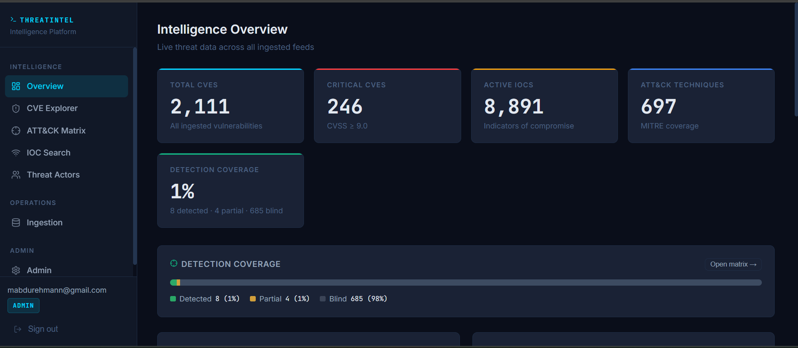

---

## Why it exists

Security analysts pull from four disconnected public sources — each with its own format,
cadence, and vocabulary. Correlating a vulnerability to the technique that exploits it, or
an indicator to the actor behind it, means manually cross-referencing multiple platforms.
This platform pulls all four into **one queryable PostgreSQL database**, correlates them,
and layers on operational context (what the team can detect) that raw feeds don't provide.

The correlation is the heart of the system: which **flaw (CVE)** is opened by which
**method (ATT&CK technique)**, spotted through which **clue (IOC)**, used by which
**actor** — all in one place.

---

## Use cases

- **SOC triage / IOC enrichment** — search or bulk-check indicators against every feed in
  one place, with automatic refang/defang handling.
- **Threat-informed patching** — rank CVEs by linked ATT&CK techniques and IOCs, weighting
  vulnerabilities that map to techniques the team **can't detect**.
- **Detection gap analysis** — mark each ATT&CK technique Detected / Partial / None with
  notes, turning the matrix into a live "where are we blind?" map.
- **Threat-actor research** — pivot from an actor to their techniques, CVEs, and IOCs.
- **Situational awareness** — a dashboard of the threat landscape *and* the team's own
  detection posture.

---

## Features

### CVE Explorer
Severity / score / CWE filters, PostgreSQL full-text search, per-CVE threat signals
(linked techniques, linked IOCs, and a red **"blind"** badge when a CVE maps to a
technique with no detection coverage), and a coverage-weighted "threat-informed" sort.

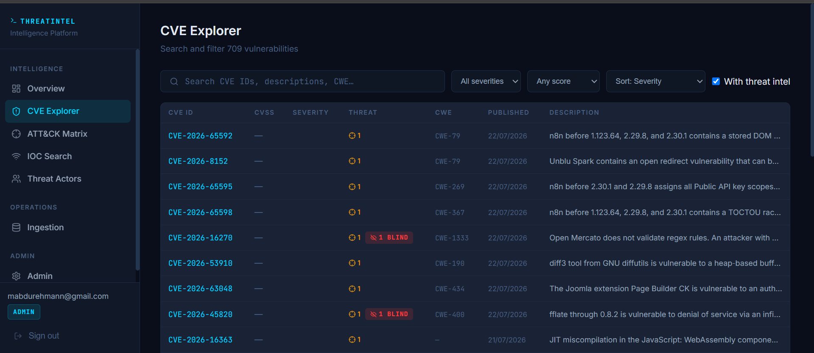

### ATT&CK Matrix — frequency + detection coverage
A heatmap of technique frequency (IOC + CVE co-occurrence), plus a **Detection coverage**
overlay. Contributors and admins click any cell to set its status and add notes.

<p>
  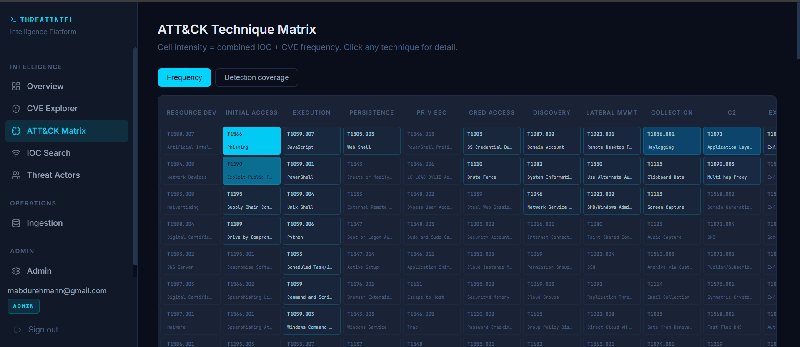
  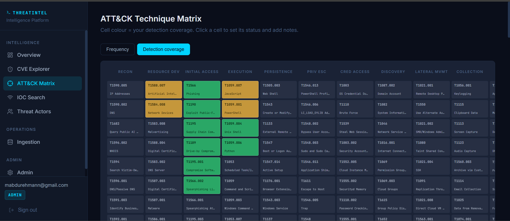
</p>

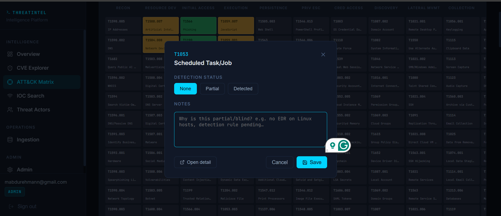

### IOC Search & Bulk Lookup
Trigram fuzzy search and exact match, filters by type and feed, plus a **bulk lookup**
(up to 500 indicators) that understands defanged input and can copy results back out
defanged for safe pasting into tickets.

<p>
  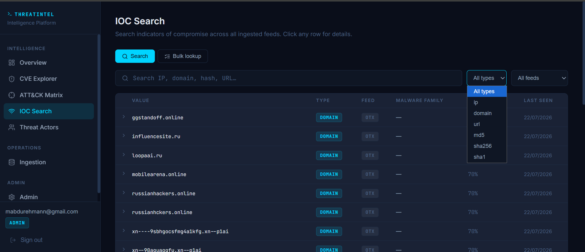
  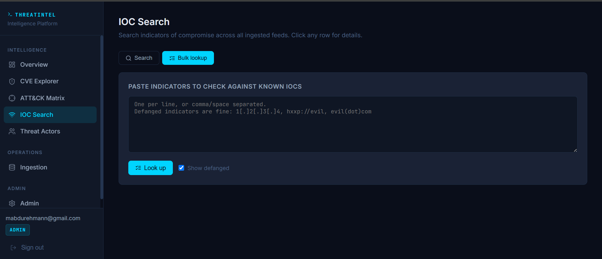
</p>

### Detection coverage layer
Per-technique status (None / Partial / Detected), free-text notes, and attribution (who
set it and when). It feeds both the CVE prioritization and a dashboard coverage
percentage.

### Threat Actors
Adversary profiles with their mapped ATT&CK techniques, aliases, motive, and country.

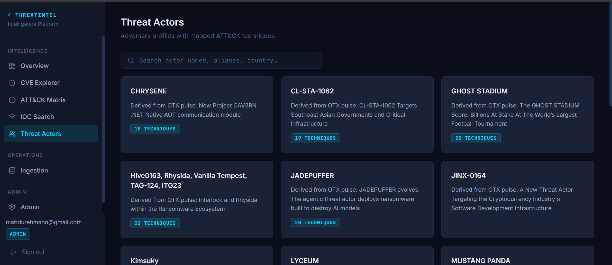

### Access control (database-enforced)
Three roles — **read-only** (view), **contributor** (write data + run ingestion), and
**admin** (manage users) — enforced by distinct PostgreSQL roles, `GRANT`/`REVOKE`, and
row-level security, not just application code. JWT auth with bcrypt-hashed passwords.

- **Public sign-up** creates a read-only account.
- **Contributor requests** — a read-only user requests an upgrade; an admin approves or
  declines it (role change takes effect live, no re-login).
- **Admin protection** — admin accounts can't be deactivated.

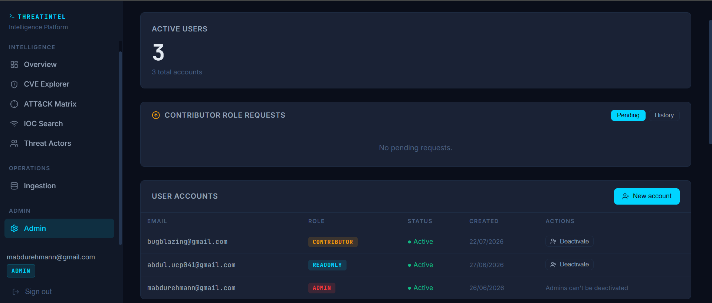

### Auditing
A full activity log of sign-ups, role changes, request decisions, ingestion runs, and
detection-coverage edits (with before → after).

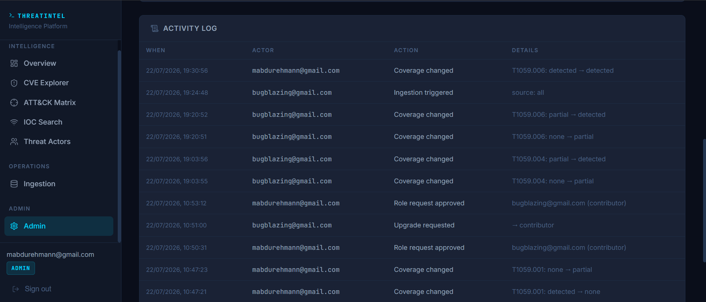

### Ingestion
Scheduled (cron) and on-demand manual runs across all four feeds, with a post-ingestion
**linker** that correlates CVEs and IOCs to ATT&CK techniques.

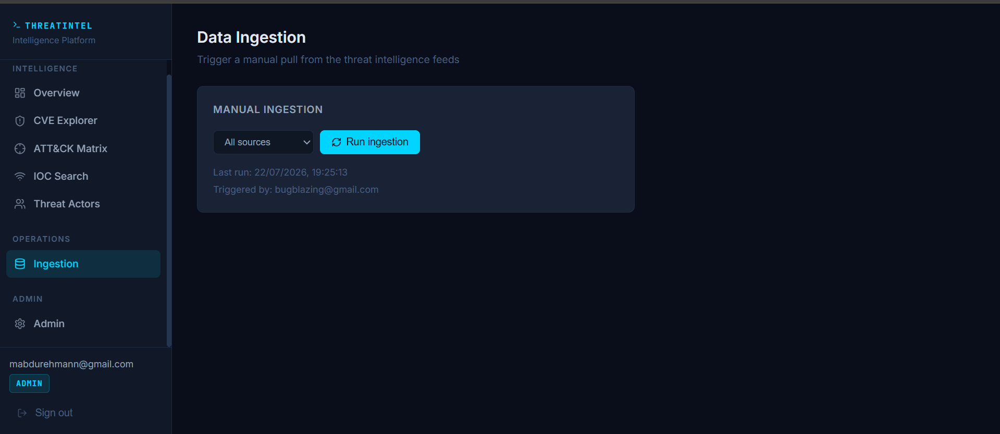

---

## Tech stack

| Layer | Technology |
|-------|-----------|
| Frontend | React, Vite |
| Backend | Node.js, Express, JWT, bcrypt |
| Database | PostgreSQL — views, indexes (B-tree/GIN/GiST), full-text search, row-level security |
| DB tooling | Knex (migrations), full-text triggers, audit logging |

### Data sources

| Source | What it provides | Auth |
|--------|-----------------|------|
| MITRE ATT&CK | Tactics, techniques, sub-techniques | None (public JSON) |
| NVD CVE Feed (NIST) | CVEs with CVSS scores and affected products | None (public API) |
| Abuse.ch | Malware hashes, C2 URLs, botnet IOCs | None (public feeds) |
| AlienVault OTX | Community threat pulses with ATT&CK mappings | API key (free) |

---

## Prerequisites

| Tool | Version | Install |
|------|---------|---------|
| Node.js | ≥ 18 | https://nodejs.org |
| npm | ≥ 9 | bundled with Node |
| PostgreSQL | ≥ 14 | https://www.postgresql.org/download/ |

---

## Quick start

### 1. Clone and install

```bash
git clone <your-repo>
cd threat-intel
npm install          # installs both server/ and client/ workspaces
```

### 2. Configure environment

```bash
cp .env.example .env
# Open .env and set your passwords and API keys
```

### 3. Bootstrap the database

Make sure PostgreSQL is running, then:

```bash
bash scripts/setup-db.sh
```

This creates the three PostgreSQL roles (`threat_admin`, `threat_readonly`,
`threat_contributor`), creates the `threat_intel` database, and runs all migrations
(tables → views → indexes → triggers → access control → role requests → detection
coverage → audit log).

### 4. Run the app

```bash
npm run dev:server   # Express API on http://localhost:3001
npm run dev:client   # React app on http://localhost:5173
```

### 5. Load data

Trigger an ingestion from the **Ingestion** page (as a contributor/admin) or:

```bash
npm run ingest --workspace=server
```

---

## Database migrations

```bash
npm run migrate           # run pending migrations
npm run migrate:rollback  # roll back last batch
```

| # | File | DB concept |
|---|------|-----------|
| 001 | `roles_and_extensions` | Setup: pg_trgm, unaccent, PG roles |
| 002 | `core_tables` | Schema: techniques, cves, iocs, threat_actors, users, cve_technique_map |
| 003 | `views` | **Views**: high_severity_cves, active_iocs, technique_frequency |
| 004 | `indexes` | **Indexing**: B-tree, GIN, GiST across all tables |
| 005 | `fulltext_triggers` | **Full-Text Search**: tsvector triggers on cves + threat_actors |
| 006 | `access_control` | **Access Control**: GRANT/REVOKE + RLS on users |
| 007 | `role_requests` | Self-service contributor role requests |
| 008 | `technique_detection` | Detection status + notes on techniques |
| 009 | `detection_attribution` | Who/when set each technique's coverage |
| 010 | `audit_log` | Audit trail of privileged actions |
| 011 | `contributor_view_grants` | Grant contributors SELECT on the views |

---

## Data model

Eight tables. The core six plus two for governance:

| Table | Primary key | Foreign keys |
|-------|-------------|--------------|
| `users` | id | — |
| `techniques` | id | — *(+ detection_status, notes, attribution)* |
| `cves` | id | — |
| `threat_actors` | id | — |
| `iocs` | id | linked_cve_id, linked_technique_id |
| `cve_technique_map` | id | cve_id, technique_id |
| `role_requests` | id | user_id |
| `audit_log` | id | (actor_id — soft ref) |

`CVEs ↔ Techniques` is many-to-many through `cve_technique_map`. IOCs carry two separate
optional foreign keys — one to a CVE, one to a technique.

---

## Project structure

```
threat-intel/
├── .env.example
├── docs/screenshots/        ← images used by this README
├── scripts/setup-db.sh      ← one-time DB bootstrap
├── server/
│   └── src/
│       ├── db/
│       │   ├── knexfile.js         ← Knex config (dev/prod)
│       │   ├── db.js               ← role-aware connection pools
│       │   └── migrations/         ← 001–011
│       ├── routes/                 ← Express route handlers
│       ├── middleware/             ← JWT auth + common
│       ├── lib/                    ← audit logging
│       └── ingestion/              ← feed scripts + linker
└── client/                         ← React app
```

---

## Authentication at a glance

<p>
  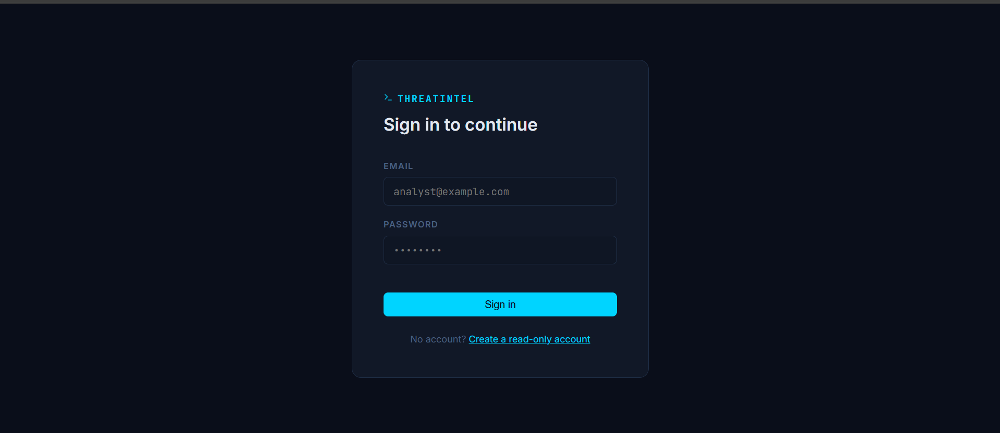
  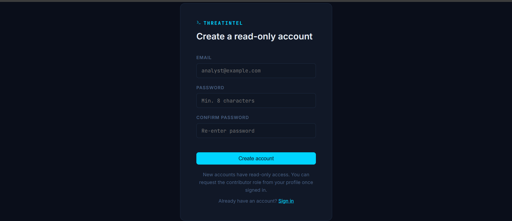
</p>

Login exchanges email + password for a JWT that carries the user's role; the API then
attaches the matching PostgreSQL connection pool, so the database itself enforces
permissions on every request.
